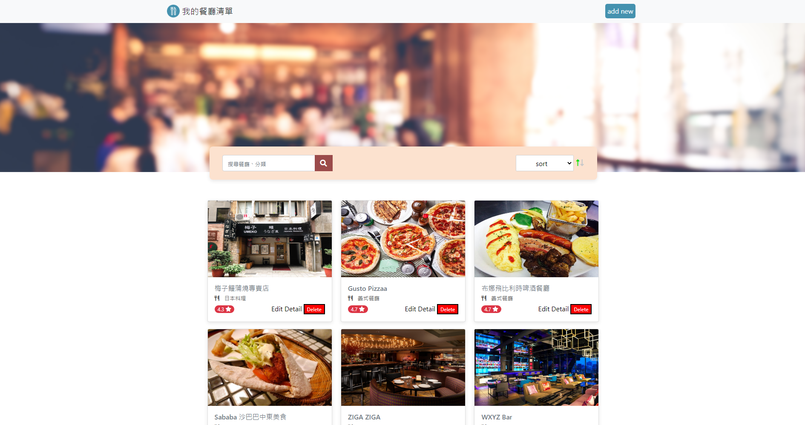
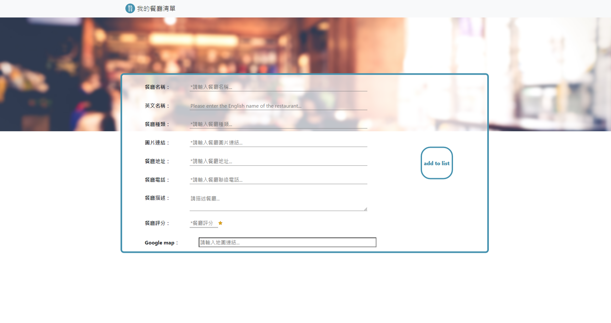
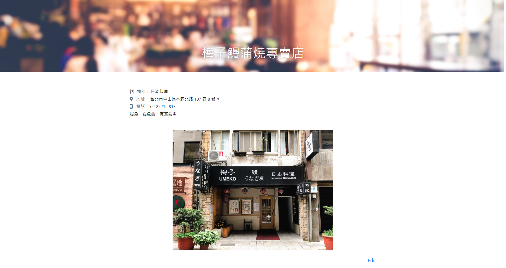

# **我的餐廳清單**

重構專案，並依照 RESTful 風格進行改動，新增排序功能

&nbsp;
## **專案功能**

* 使用者可以在首頁看到所有餐廳與它們的簡單資料：
    * 餐廳照片
    * 餐廳名稱
    * 餐廳分類
    * 餐廳評分

* 使用者可以再點進去看餐廳的詳細資訊：
    * 類別
    * 地址
    * 電話
    * 描述
    * 圖片

* 使用者可以透過搜尋餐廳名稱來找到特定的餐廳

* 使用者可以透過搜尋餐廳類別來找到特定的餐廳

* 使用者可以新增一家餐廳

* 使用者可以修改一家餐廳的資訊

* 使用者可以刪除一家餐廳

> 新功能

* 使用者可以利用分類來排序清單

* 使用者可以選擇升序或降序的排序方式

&nbsp;
## **環境建置與需求**

* [Node.js](https://nodejs.org/en/) - v16.14.2
* [MongoDB](https://www.mongodb.com/zh-cn/cloud/atlas/efficiency) - Atlas


&nbsp;
## **安裝與執行步驟**


１.在專案資料夾中使用終端機

```properties
cd restaurant_list_CRUD
```

２.安裝node套件

```properties
npm install
```

３.若使用自己的MongoDB資料庫
> mongoose.js 第3行 修改連線資料庫
```js
mongoose.connect('資料庫URI', { useNewUrlParser: true, useUnifiedTopology: true })
```
> 載入種子資料

利用終端機載入種子資料

```properties
npm run seed
```

４.執行專案
> node
```properties
npm run start
```

> nodemon(視需求)

```properties
npm run dev
```

５.在瀏覽器上瀏覽專案

```
http://localhost:3000
```

專案啟動成功時，終端機輸出
```
Express is listening on http://localhost:3000
```
資料庫連接成功時，終端機輸出
```
mongodb connected
```

&nbsp;
## **專案畫面**

餐廳清單


新增餐廳


瀏覽餐廳


編輯餐廳

